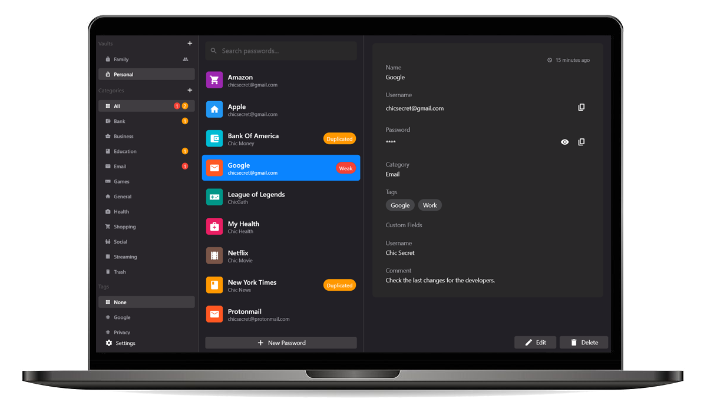
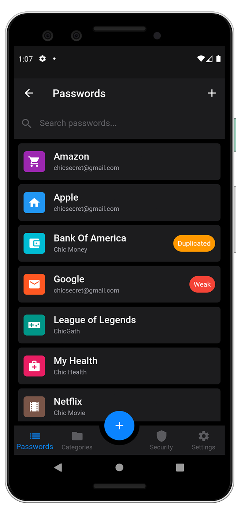

# 🔒 Chic Secret

Chic Secret is an **open source** password manager available on Windows/Macos/Android/iOS.

The goal of Chic Secret is to give everyone the opportunity to safely save their passwords and be proactive about their online **privacy**.

Personal data is not saved nor sold. Only the email and password's data used to synchronize your vault across all your devices are stored.

# 🌐 Website

https://chic-secret.com

> The Windows version is only available through the website

# 🏪 Stores

- [Android](https://play.google.com/store/apps/details?id=com.applichic.chic_secret)
- [iOS](https://apps.apple.com/us/app/chic-secret/id1546914578#?platform=iphone)
- [Windows](https://chic-secret.com/assets/release/windows-chic-secret.zip)
- [Mac](https://apps.apple.com/us/app/chic-secret/id1546914578#?platform=mac)

# 🖥️ Desktop

# 📱 Smartphone

